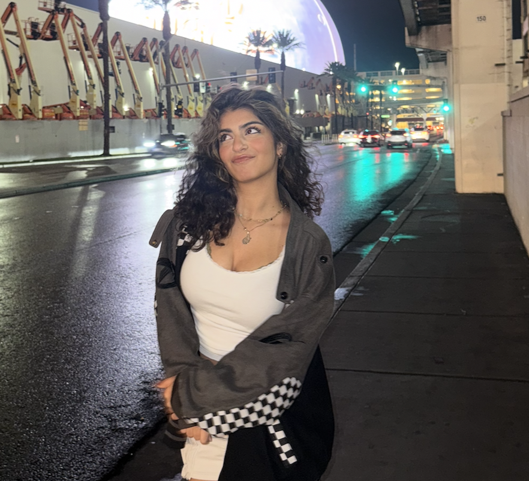
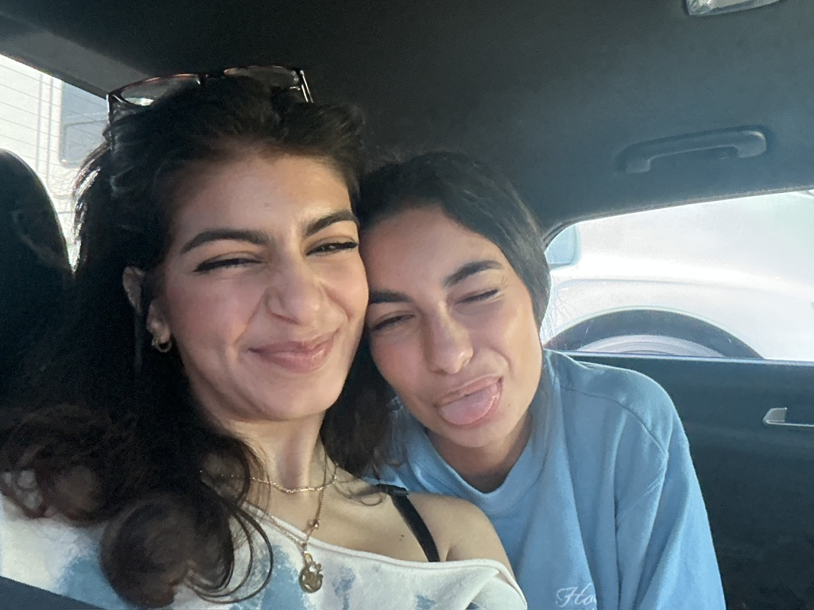

# Hi! I'm Shazi Bidarian

## About Me
I'm a Computer Science major at UC San Diego and a software engineer at Aesthetic. I love building things that actually *do something* and people would actually use. I am especially interested in AI, machine learning, and creating full-stack systems that feel seamless to use.

- ML Fellow @ Break Through Tech AI (Cornell Tech)
- SWE at Aesthetic
- Artist turned engineer
- Music on 24/7

---

## As a Programmer
I like working on:
1. Full-stack applications
2. Machine learning systems
3. Data-driven products

### Tech I Use
- Languages: `Python`, `C++`, `TypeScript`
- Tools: `Next.js`, `Tailwind`, `AWS`, `Pandas`, `Scikit-learn`

> “Code is not just about solving problems — it’s about building things people actually want to use.”

---

## As a Person
- I play a bunch of instruments (piano + guitar are my favorite, even brought my acoustic to my dorm)
- I figure skate
- I game (although I'm washed now, I had to leave my PC back home :( )
- I love working at new cafes and locations

## Pictures

### Me

### Me and my best friend Sara


---

## Links

### External Links
- [My portfolio](https://shazi-bidarian-portfolio.vercel.app/)
- [Github](http://github.com/shazibid)
- [Linkedin](https://www.linkedin.com/in/shazi-bidarian/)

### Section Links
- [Go to Tech I Use](#tech-i-use)
- [Go to About Me](#about-me)

### Relative Links
- [View another markdown file](./README.md)

## Code Snippet

Here’s a small example of something I’d write:

```python
def dominant_color(pixels):
    """
    Returns the most common RGB value from an image.
    """
    counts = {}
    for pixel in pixels:
        counts[pixel] = counts.get(pixel, 0) + 1
    return max(counts, key=counts.get)